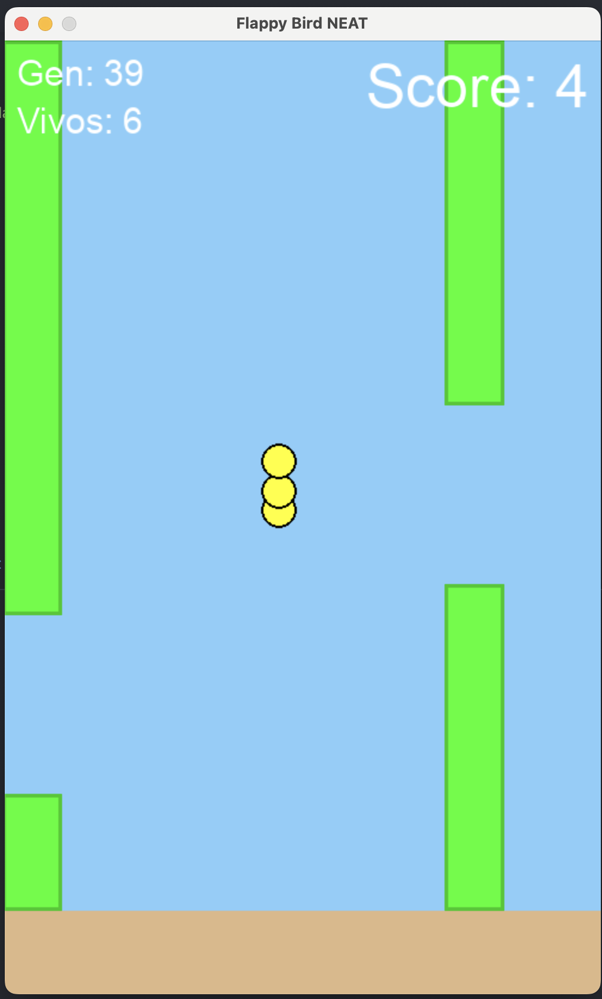
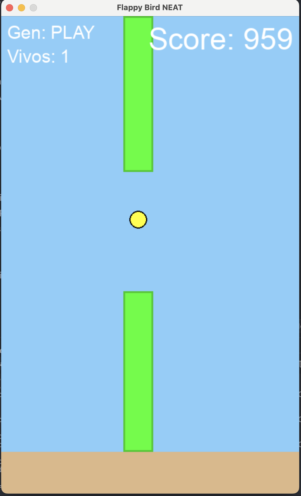

# Flappy Bird AI - NEAT Neural Network

A Flappy Bird implementation where neural networks learn to play the game perfectly using NEAT (NeuroEvolution of Augmenting Topologies).


<p align="center">
  
  
</p>
<p align="center">
  <em>Left: Training with multiple birds (Gen 39) | Right: Trained AI playing perfectly (Score 959)</em>
</p>

## 🎮 What does it do?

The program trains multiple birds simultaneously using genetic evolution. In each generation:
- 50 birds attempt to play
- Birds that go further have better fitness scores
- The best performers reproduce and mutate
- After 20-40 generations, the AI masters the game completely

## 🧠 How it works

### Neural Network Inputs (3):
1. Bird's Y position
2. Distance to top pipe edge
3. Distance to bottom pipe edge

### Output (1):
- If > 0.5 → Jump
- If ≤ 0.5 → Do nothing

### Fitness Function:
- +0.1 for each frame survived
- +5 for each pipe passed
- -1 for collision

### Evolution:
NEAT automatically evolves both the weights and structure of neural networks, starting with simple networks and complexifying them as needed.

## 🚀 Installation

```bash
pip install -r requirements.txt
```

## ▶️ Usage

### First time (Training):
```bash
python main.py --train
```

This will:
- Train 50 birds over up to 100 generations (5-15 minutes)
- Save the best model as `best_bird.pkl`
- Show training progress in real-time
- Stop early if fitness threshold (1000) is reached

### Watch the trained AI play:
```bash
python main.py --play
```

This loads the saved model and watches it play indefinitely!

### Auto mode:
```bash
python main.py
```
- If no model exists: starts training
- If model exists: shows options

## 📊 What you'll see

- **Gen**: Current generation number
- **Vivos** (Alive): Number of birds still alive
- **Score**: Pipes passed in this generation
- Multiple yellow birds learning simultaneously

## 🎯 Game Difficulty

The game is configured with balanced parameters:
- **Gap between pipes**: 200px
- **Pipe speed**: 5 px/frame
- **Game speed**: 40 FPS
- **Pipe height range**: 50-450px
- **Training generations**: Up to 100 (stops early if fitness threshold reached)

## ⚙️ Configuration

Edit `config-neat.txt` to modify NEAT parameters:
- `pop_size`: Birds per generation (default: 50)
- `fitness_threshold`: Fitness goal (default: 10000)
- Mutation rates and other evolutionary parameters

## 📁 Project Structure

```
flappyAI/
├── main.py              # Main loop with NEAT integration
├── bird.py              # Bird class with physics
├── pipe.py              # Pipe class with collision detection
├── game.py              # Game logic and rendering
├── config-neat.txt      # NEAT configuration
├── requirements.txt     # Dependencies
├── best_bird.pkl        # Trained model (created after training)
└── demo.png             # Demo screenshot
```

## 📈 Typical Training Progress

- **Generation 0-10**: Most birds die quickly, learning basic timing
- **Generation 10-25**: Birds start passing multiple pipes consistently
- **Generation 25-50**: Significant improvement, reaching 20-50+ pipes
- **Generation 50+**: Mastery achieved, birds play indefinitely (or training stops at fitness threshold)

## 🔧 Customization

### Make it easier:
In `pipe.py`:
- Increase `GAP` (e.g., 250)
- Decrease `VEL` (e.g., 4)

### Make it harder:
In `pipe.py`:
- Decrease `GAP` (e.g., 150)
- Increase `VEL` (e.g., 7-9)

## 📚 Technologies Used

- **Python 3.11+**: Core language
- **Pygame 2.5.2**: Graphics and game engine
- **NEAT-Python 0.92**: Neuroevolution algorithm
- **NumPy 1.26.4**: Numerical operations

## 💾 Saving & Loading Models

After training, the best performing neural network is automatically saved as `best_bird.pkl`. This means:
- ✅ Train once, play forever
- ✅ No need to retrain every time
- ✅ Share your trained models with others
- ✅ The model file is small (~few KB)

To train a fresh model, simply delete `best_bird.pkl` or use `--train` flag.

## 💡 Tips

- Training typically takes 5-15 minutes depending on when it converges
- If evolution stagnates, adjust `weight_mutate_rate` or `conn_add_prob` in `config-neat.txt`
- Press close button to stop training and see best genome
- The algorithm is stochastic - results vary between runs
- The trained bird can play indefinitely with `--play` mode
- If training fails (low fitness), increase `GAP` in `pipe.py` temporarily

## 🤝 Contributing

Feel free to fork, improve, and submit pull requests!

## 📝 License

MIT License - feel free to use this project for learning and experimentation.

## 🌟 Acknowledgments

Inspired by the classic reinforcement learning problem of teaching AI to play games through evolution.
